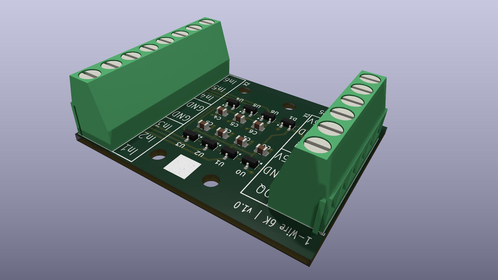
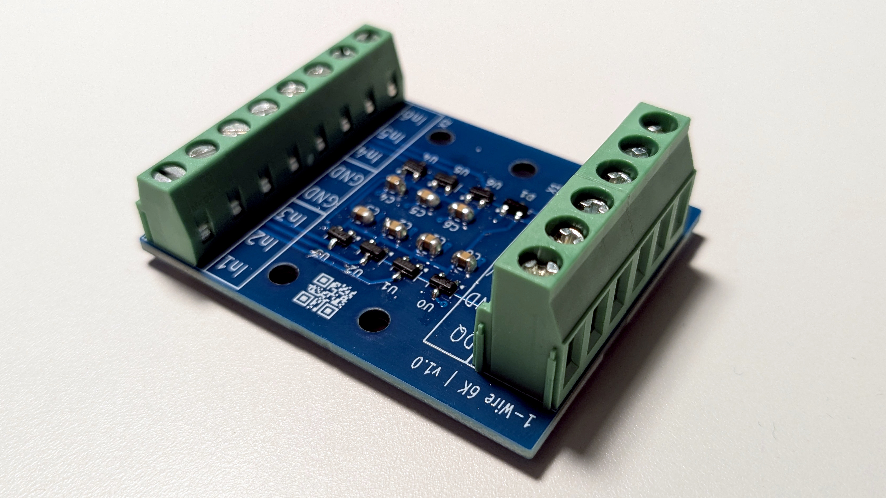
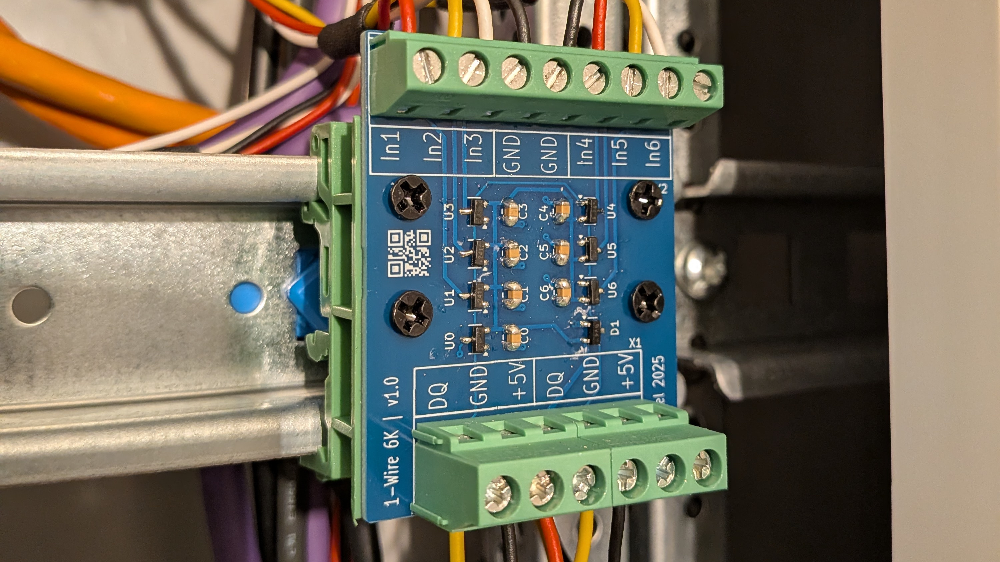

# 1-Wire 6-Channel Binary Input Board using DS2411

A compact PCB providing six independent binary input channels on a 1-Wire bus, each based on a dedicated [DS2411](doc/ds2411.pdf) unique-ID device.
Prepared for use in standard 35 mm DIN-rail mounting enclosures.

## Hardware

### Schematic

see [1w-6K_schematic.pdf](doc/1w-6K_schematic.pdf).

### Rendering / Photo

### DIN-rail mounting

The PCB can be mounted to standard 35mm DIN rails using common _25mm DIN Rail Mounting Adapter_ with hole spacing of **12.5mm**.

## Key Features

* 6 × DS2411 devices connected to a the 1-Wire bus
  * Each DS2411 has its GND routed to an individual screw terminal.
  * A binary input channel is considered “closed” when its DS2411 (with factory-programmed 64-bit ROM ID) becomes visible on the bus.

* 1 additional DS2411 permanently connected to the bus.
  * Can be used for alive checks or bus identification

## How It Works

Each binary input corresponds to the GND line of one DS2411.
When GND is connected externally:

* The DS2411 becomes electrically active.
* Its globally unique 64-bit ID appears on the 1-Wire bus.
* The host system interprets this as input active / closed.

### Typical use cases

* Window open / closed detection
* Presence / absence detection

## Development

- PCB designed with [KiCad](https://www.kicad.org/)
- Production files created with KiCad plugin [KiCAD JLCPCB tools](https://github.com/Bouni/kicad-jlcpcb-tools)
